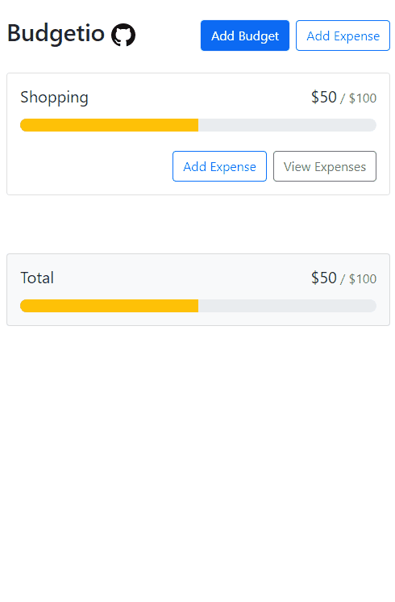
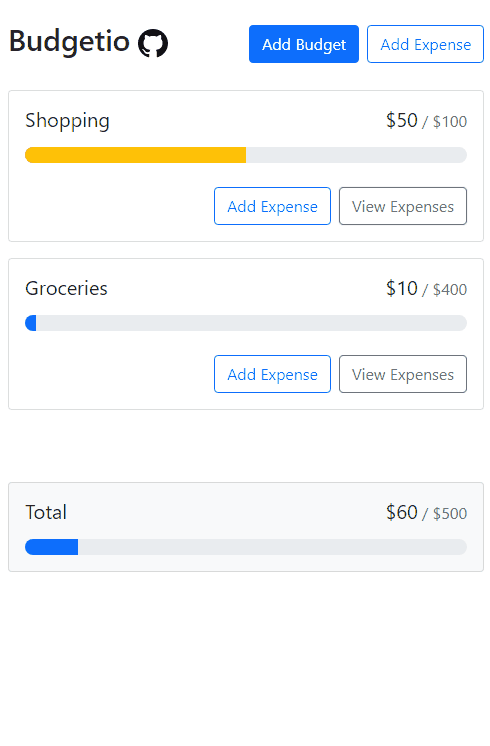
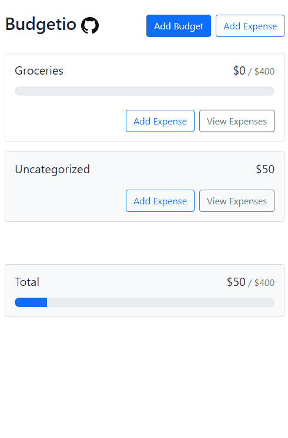

## Budgetio

Budgetio is a very simple Budget Calculator built using React and localStorage. 

- [Demo Website Budgetio](https://budgetio.netlify.app/)

## FEATURES

### Adding Budgets + Expenses

To start tracking expenses we first need to add budget categories (with a default uncategorized category)
Then we start adding expenses to our categories

### Viewing + Deleting

For each budget category we can see the list of expenses added to it and delete expenses / budgets.
When we delete budgets or expenses their amount goes into the uncategorized as untracked

### Overbudget

Going Over budget triggers a color warning 

## Features

Features Done :

- [x] Add Budget + Expenses
- [x] Show Budget + Expenses
- [x] Delete Budget + Expenses
- [x] Tracking deleted expenses
- [x] Calculating the Total

Todo :

- [ ] Better Design
- [ ] ...

## Built With

- React
- React Bootstrap
- Features Prop Drilling, useEffect, useState and Context, localStorage

## Author

**Bensaad Soukaina**

- [Linkedin](https://www.linkedin.com/in/soukaina-bensaad/ "Linkedin")

